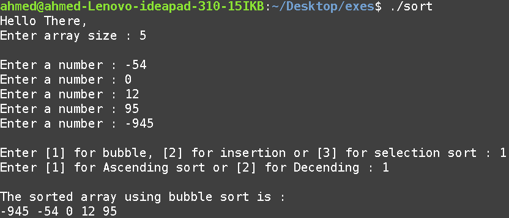

# Assembly Sorting

# Table of Contents
1. [Introduction](#1---introduction)

2. [Environment Setup](#2---environment-setup)

    2.1 Install NASM and SASM
    
    2.2 Editor Settings

3. [Examples](#3---examples)

    3.1 Bubble sort - Ascending order
    
    3.2 Insertion sort - Ascending order
    
    3.3 Selection sort - Ascending order
    
    3.4 Bubble sort - Descending order
    
    3.5 Insertion sort - Descending order
    
    3.6 Selection sort - Descending orde
    
    3.7 Negatize array size
    
    3.8 Wrong sorting algorithm number
    
    3.9 Wrong sorting type number

4. [Resources](#4---resources)

    4.1 Assembly Tutorial
    
    4.2 NASM

## 1 - Introduction
### Sorting algorithms implementation in NASM (Netwide Assembly)

This program prompts the user for array size, the numbers to sort, the type of sorting algorithm, type of sorting (ascending or descending), then sorts the array using the chosen sorting algorithm and prints the sorted array.

There are are 3 options for the sorting algorithm.
1. Bubble sort.
2. Insertion sort.
3. Selection sort.

## 2 - Environment setup

2.1 Install NASM and SASM
```$ sudo apt-get install nasm sasm```

2.2 Editor Settings


## 3 - Examples

- Bubble sort - Ascending order


- Insertion sort - Ascending order


- Selection sort - Ascending order


- Bubble sort - Descending order


- Insertion sort - Descending order


- Selection sort - Descending order


### Dealing with bad input

- Negatize array size


- Wrong sorting algorithm number


- Wrong sorting type number


## 4 - Resources

4.1 - [Assembly Tutorial](./resources/assembly_tutorial.pdf)

4.2 - [NASM](./resources/NASM.pdf)
